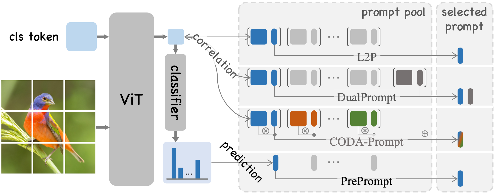

# 🌟 PrePrompt: Predictive Prompting for Class-Incremental Learning [](https://arxiv.org/abs/2505.08586) [](https://opensource.org/licenses/MIT) [](https://pytorch.org) [](https://www.python.org/) 

[中文](README_zh.md) | **English**

<p align="center">
  
  
</p>
<p align="center">
  <em>Figure 1: PrePrompt two-stage framework (left) and feature extrapolation mechanism (right).</em>
</p>

🔥 Official PyTorch implementation of **PrePrompt**, a two-stage predictive prompting framework that enables pre-trained models to first predict task-specific prompts and then perform label prediction, effectively balancing stability and plasticity in class-incremental learning.

---

## 🧠 Overview
<p align="center">
  
</p>
<p align="center">
  <em>Figure 2: Main difference between conventional prompt-based CIL methods and PrePrompt.</em>
</p>

**PrePrompt** introduces a *predictive prompting mechanism* that leverages pre-trained models' natural classification ability to predict task-specific prompts.

Unlike conventional prompt-based CIL methods that rely on correlation-based strategies, where an image's classification feature is used as a query to retrieve the most related key prompts and select the corresponding value prompts for training, PrePrompt circumvents the correlation-based limitations that fitting the entire feature space of all tasks with only a few trainable prompts - ensuring **robust knowledge retention**, **minimal forgetting**, and **efficient adaptation**.

> 📄 **Reference Paper:**  
> [PrePrompt: Predictive Prompting for Class-Incremental Learning (arXiv:2505.08586)](https://arxiv.org/abs/2505.08586)

If you find this work helpful, please consider citing:
```bibtex
@article{huang2025preprompt,
  title={PrePrompt: Predictive Prompting for Class Incremental Learning},
  author={Huang, Libo and An, Zhulin and Yang, Chuanguang, and Diao, Boyu et al},
  journal={arXiv preprint arXiv:2505.08586},
  year={2025},
  date={13 May}
}
```

## 🚀 Key Highlights

- 🧩 **Predictive Prompting**: Learns to anticipate task evolution, improving long-term adaptability.
- 📈 **State-of-the-Art Results**: Outperforms all prior prompt-based CIL methods across multiple benchmarks.
- ⚡ **Lightweight Integration**: Minimal computation overhead — plug-and-play for any ViT-based model.
- 🔁 **Stable & Scalable**: Balances plasticity (learning new tasks) and stability (preserving old knowledge).

## 📊 Benchmark Results
10 tasks with equal number of classes  of CIFAR-100, ImageNet-R, CUB-200 while 5 tasks of 5-Datasets:

| Dataset | Final Accuracy (%) ↑ | Average Incremental Accuracy (%) ↑ | Forgetting Rate (%) ↓|
|---------|-------------------|----------------------------------|---------------------|
| CIFAR-100 | 93.74 | 95.41 | 1.27 |
| ImageNet-R | 75.09 | 78.96 | 1.11 |
| CUB-200 | 88.27 | 88.29 | 1.81 |
| 5-Datasets | 94.54 | 95.78 | 0.21 |

*📘 Detailed results and analyses can be found in our [paper](https://arxiv.org/abs/2505.08586).*

## 🛠️ Installation

### Environment Setup
```bash
# Create and activate conda environment
conda create -n preprompt python=3.8 -y
conda activate preprompt

# Install dependencies (retry if network issues occur)
pip install -r requirements.txt
```

### Dependencies
``` text
timm==0.6.7
pillow==9.2.0
matplotlib==3.5.3
torchprofile==0.0.4
torch==1.13.1
torchvision==0.14.1
urllib3==2.0.3
scipy==1.7.3
scikit-learn==1.0.2
numpy==1.21.6
```


## 📁 Datasets
PrePrompt automatically handles downloading and preprocessing for the following datasets:
- 🖼️ [CIFAR-100](https://www.cs.toronto.edu/~kriz/cifar-100-python.tar.gz) — 100-class object recognition
- 🎨 [ImageNet-R](https://people.eecs.berkeley.edu/~hendrycks/imagenet-r.tar) — artistic renditions of ImageNetrenditions
- 🐦 [CUB-200](https://data.caltech.edu/records/65de6-vp158/files/CUB_200_2011.tgz) — fine-grained bird classification
- 🔢 5-Datasets — composite of SVHN, MNIST, CIFAR-10, notMNIST, and Fashion-MNIST

💡 Tip: If your network is unstable, pre-download datasets into `./datasets/`.

## 🎯 Quick Start
Run the corresponding training scripts for each benchmark:
```bash
# CIFAR-100 Experiments
bash training_scripts/train_cifar100_vit.sh

# ImageNet-R Experiments  
bash training_scripts/train_imr_vit.sh

# CUB-200 Fine-grained Classification
bash training_scripts/train_cub_vit.sh

# 5-Datasets Sequential Learning
bash training_scripts/train_5datasets_vit.sh
```
Logs and checkpoints will be stored in `./outputs/`.


## 🙏 Acknowledgments
This repository builds upon the following excellent open-source projects:
- [DualPrompt](https://github.com/JH-LEE-KR/dualprompt-pytorch) — continual prompting foundations.
- [HiDe-Prompt](https://github.com/thu-ml/HiDe-Prompt) — hierarchical prompt architecture

We deeply thank the authors of these works for their inspiring contributions.

## 📜 License
This project is released under the MIT License. See the [LICENSE](./LICENSE) file for details.

## 💬 Contact
For questions, discussions, or collaboration:
- 🧑‍💻 Maintainer: [Libo Huang](https://github.com/libo-huang)
- 📫 Email: *via GitHub issues or repository discussions*

---

<div align="center">
⭐ If you find PrePrompt useful, please star this repo — it helps others discover our work!</br>
📖 Cite our paper to support open and reproducible continual learning research.
</div>
