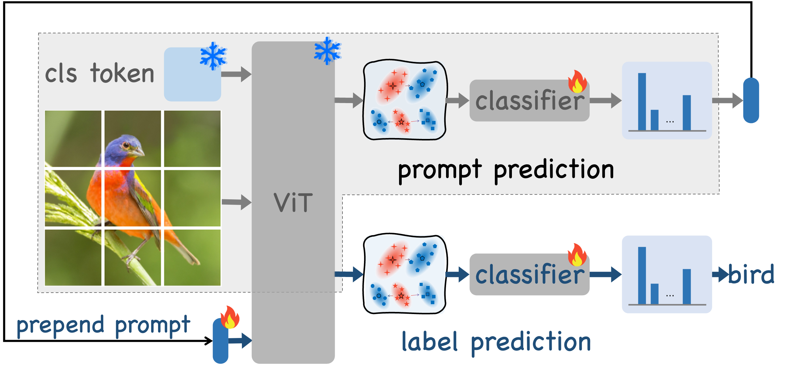
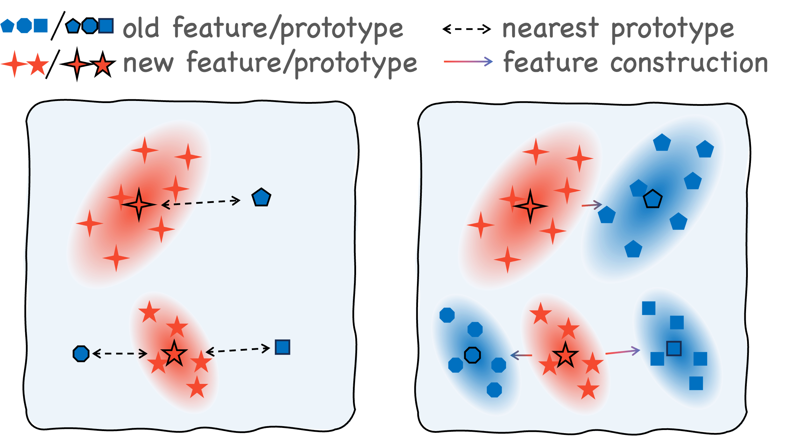
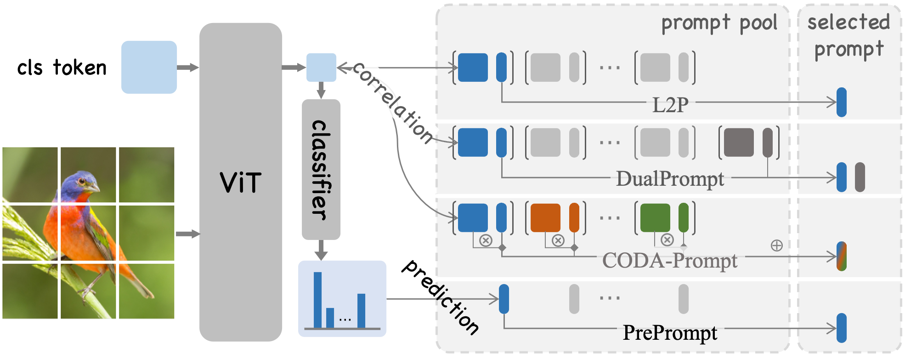

# 🌟 PrePrompt: 面向类增量学习的预测式提示学习 [](https://arxiv.org/abs/2505.08586) [](https://opensource.org/licenses/MIT) [](https://pytorch.org) [](https://www.python.org/)

**中文**| [English](README.md)

<p align="center">
  
  
</p>
<p align="center">
  <em>图 1: PrePrompt 的两阶段框架（左）与特征外推机制（右）。</em>
</p>

🔥 **PrePrompt** 的官方 PyTorch 实现。这是一个两阶段的预测式提示学习框架，使预训练模型能够先预测任务特定的提示，再进行标签预测，从而在类增量学习中有效平衡**稳定性**与**可塑性**。

---

## 🧠 概述
<p align="center">
  
</p>
<p align="center">
  <em>图 2: 传统基于提示的类增量学习方法与 PrePrompt 的主要区别。</em>
</p>

**PrePrompt** 引入了一种*预测式提示机制*，它利用预训练模型固有的分类能力来预测任务特定的提示。

与传统基于提示的类增量学习方法不同（后者依赖于基于相关性的策略，即用图像的分类特征作为查询来检索最相关的键提示，并选择对应的值提示进行训练），PrePrompt 规避了基于相关性方法的局限性——即试图用少量可训练的提示去拟合所有任务的整个特征空间。这确保了**稳健的知识保留**、**最小的遗忘**和**高效的适应能力**。

> 📄 **参考文献：**
> [PrePrompt: Predictive Prompting for Class-Incremental Learning (arXiv:2505.08586)](https://arxiv.org/abs/2505.08586)

如果您觉得这项工作对您有帮助，请考虑引用：
```bibtex
@article{huang2025preprompt,
  title={PrePrompt: Predictive Prompting for Class Incremental Learning},
  author={Huang, Libo and An, Zhulin and Yang, Chuanguang, and Diao, Boyu et al},
  journal={arXiv preprint arXiv:2505.08586},
  year={2025},
  date={13 May}
}
```

## 🚀 核心亮点
- 🧩 预测式提示：学习预测任务的演变，提升长期适应能力。
- 📈 业界领先的结果：在多个基准测试中，性能超越所有先前的基于提示的类增量学习方法。
- ⚡ 轻量级集成：计算开销极小——即插即用，适用于任何基于 ViT 的模型。
- 🔁 稳定且可扩展：平衡了可塑性（学习新任务）和稳定性（保留旧知识）。

## 📊 基准测试结果
在 CIFAR-100、ImageNet-R、CUB-200 上进行了 10 个任务（每任务类别数相等）的测试，在 5-Datasets 上进行了 5 个任务的测试：

| 数据集 | 最终准确率 (%) ↑ | 平均增量准确率 (%) ↑ | 遗忘率 (%) ↓|
|---------|-------------------|----------------------------------|---------------------|
| CIFAR-100 | 93.74 | 95.41 | 1.27 |
| ImageNet-R | 75.09 | 78.96 | 1.11 |
| CUB-200 | 88.27 | 88.29 | 1.81 |
| 5-Datasets | 94.54 | 95.78 | 0.21 |

*📘 详细结果与分析请参阅我们的[论文](https://arxiv.org/abs/2505.08586)。*

## 🛠️ 安装
### 环境配置
```bash
# 创建并激活 conda 环境
conda create -n preprompt python=3.8 -y
conda activate preprompt

# 安装依赖（如遇网络问题可重试）
pip install -r requirements.txt
```
### 依赖项
```text
timm==0.6.7
pillow==9.2.0
matplotlib==3.5.3
torchprofile==0.0.4
torch==1.13.1
torchvision==0.14.1
urllib3==2.0.3
scipy==1.7.3
scikit-learn==1.0.2
numpy==1.21.6
```

## 📁 数据集
PrePrompt 会自动处理以下数据集的下载和预处理：
- 🖼️ [CIFAR-100](https://www.cs.toronto.edu/~kriz/cifar-100-python.tar.gz) — 100 类物体识别
- 🎨 [ImageNet-R](https://people.eecs.berkeley.edu/~hendrycks/imagenet-r.tar) — ImageNet 的艺术化变体
- 🐦 [CUB-200](https://data.caltech.edu/records/65de6-vp158/files/CUB_200_2011.tgz) — 细粒度鸟类分类
- 🔢 5-Datasets — 由 SVHN, MNIST, CIFAR-10, notMNIST, Fashion-MNIST 组成的复合数据集

💡 提示：如果网络不稳定，可预先将数据集下载到 `./datasets/` 目录。

## 🎯 快速开始
运行对应的训练脚本来进行各基准测试：
```bash
# CIFAR-100 实验
bash training_scripts/train_cifar100_vit.sh

# ImageNet-R 实验
bash training_scripts/train_imr_vit.sh

# CUB-200 细粒度分类
bash training_scripts/train_cub_vit.sh

# 5-Datasets 序列学习
bash training_scripts/train_5datasets_vit.sh
```
日志和检查点将保存在 `./outputs/` 目录。

## 🙏 致谢
本仓库基于以下优秀的开源项目构建：
- [DualPrompt](https://github.com/JH-LEE-KR/dualprompt-pytorch) — 持续性提示学习的基础
- [HiDe-Prompt](https://github.com/thu-ml/HiDe-Prompt) — 分层提示架构

我们深深感谢这些工作的作者们所带来的启发与贡献。

## 📜 许可证
本项目基于 MIT 许可证发布。详见 [LICENSE](./LICENSE) 文件。

## 💬 联系我们
如有问题、讨论或合作意向：
- 🧑‍💻 维护者: [Libo Huang](https://github.com/libo-huang)
- 📫 邮箱: *可通过 GitHub Issues 或仓库讨论区联系*

---

<div align="center"> 
  ⭐ 如果您觉得 PrePrompt 有用，请给这个仓库点个 Star —— 这将帮助更多人发现我们的工作！</br>
  📖 引用我们的论文，支持开放、可复现的持续学习研究。
</div>
